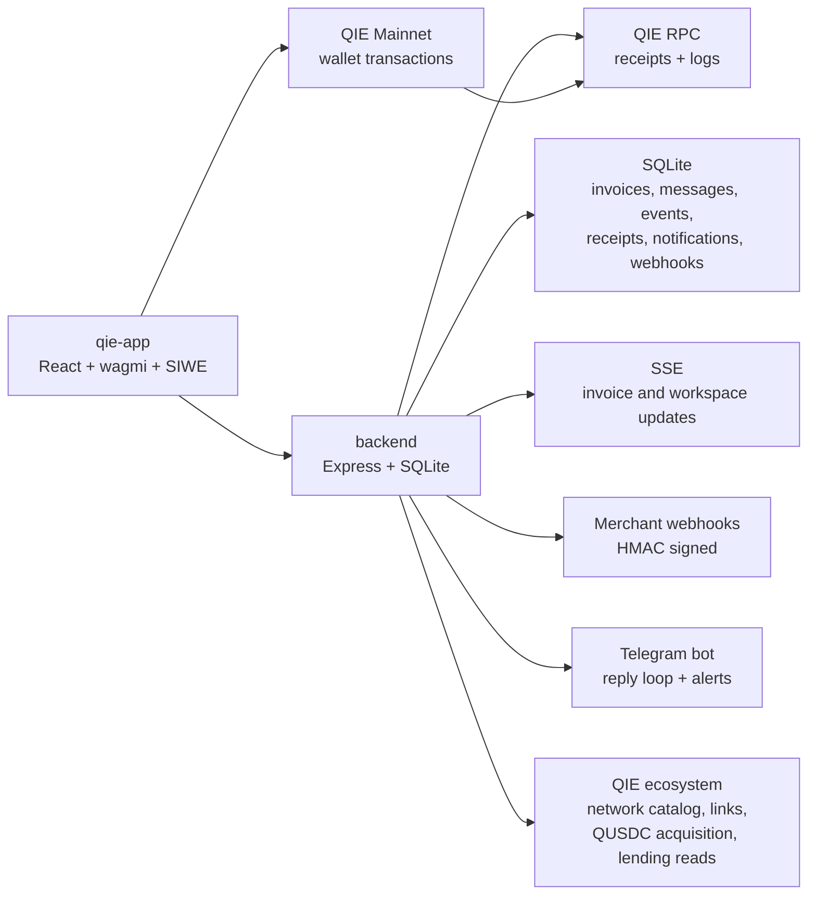

# Qantara

Qantara is a QIE-native payment workspace for merchants, payers, and developers. It creates hosted payment links, keeps invoice chat and timeline context attached to the payment, verifies settlement through QIE RPC, issues receipts only after verified payment, and delivers merchant webhooks plus Telegram notifications.

[](LICENSE)
[](https://mainnet.qie.digital)

Full callable surface (contracts, API, SDK, bot, routes): [FUNCTIONS.md](FUNCTIONS.md).

## Product Model

Qantara is not a static invoice page. It is a payment operations loop:

1. Merchant connects a wallet and creates an invoice on QIE.
2. Backend stores the invoice record and indexes contract/payment events.
3. Merchant shares `/pay/:hash` by link or QR.
4. Payer reviews merchant, token, amount, expiry, and chain status.
5. Payer and merchant can use the invoice deal-room chat before or after payment.
6. Payer submits a native QIE or configured QUSDC transaction from their wallet.
7. Backend verifies the transaction through QIE RPC and indexed events.
8. Receipt, timeline event, notification, webhook, and Telegram alert are created from verified backend state.

The frontend never marks an invoice paid by itself. Paid state and receipts require QIE RPC proof or indexed contract/token events.

## Status

Implemented:

- React merchant workspace, payer checkout, invoice chat, timelines, receipts, notifications, settings, payment proofs, and Telegram setup screens.
- Backend API with SQLite persistence, migrations, invoice/message/event/receipt/webhook/alert data, SIWE auth, API-key scopes, HMAC webhooks, and SSE.
- QIE contract registry, chain status, event indexing, payment verification, refund/cancel/pause/resume verification paths.
- Telegram bot: command-driven invoice linking, chat reply loop, and notifications, plus signed invoice/alert webhook receivers and a `/health` endpoint (full command list in [FUNCTIONS.md](FUNCTIONS.md)).
- QIE-native ecosystem layer: backend network catalog for QIE mainnet/testnet, backend RPC fallback transport, public ecosystem links registry, QUSDC acquisition routes, wallet add-network payloads, and read-only QIE lending market awareness.
- Checkout route UX is backend-planned: the Pay page shows QIE/QUSDC route candidates, disabled reasons, QUSDC capability probes, gasless paymaster availability, DEX/Bridge acquisition links, and a configured QUSDC vault mint flow.
- Payment proofs now show an explicit proof chain: create transaction, payment transaction, indexed event, backend RPC verification, receipt hash, webhook delivery, and Telegram/bot notification evidence when the authenticated backend scope can read it.
- Docker production images for backend, frontend, and Telegram bot build cleanly; containers run as non-root (`node` uid 1000, `nginx` uid 101) with healthchecks, and the backend connects to live QIE RPC (chain 1990) with the event indexer inside lag thresholds.
- The frontend nginx runtime serves all seven security headers (`X-Frame-Options: DENY`, `X-Content-Type-Options: nosniff`, Cross-Origin-Opener-Policy, Cross-Origin-Embedder-Policy, Referrer-Policy, Permissions-Policy, `Strict-Transport-Security` / HSTS) plus a `Content-Security-Policy-Report-Only` on every route — root, SPA fallback, and immutable assets — alongside the correct per-route `Cache-Control`. The same headers are mirrored by the backend API and both Vercel configs.
- Per-route SEO metadata (title, description, Open Graph, Twitter, canonical) is set via a dependency-free `useSeo` hook; payer/invoice pages are `noindex`. Static `robots.txt`, `sitemap.xml`, web manifest, and OG image ship in `qie-app/public`.
- Testing: backend unit/integration (Node test runner), frontend unit (Vitest, incl. wallet-error decoding), and Playwright e2e for critical + edge-case flows (mock wallet + mock RPC + mock backend: happy-path checkout, user-rejected payment, wrong-network auto-switch, backend-failure, missing invoice, responsive). Coverage reports upload as CI artifacts.
- Production hygiene guardrails pass: no synthetic paid state, no frontend secret build arg, no API keys in URL patterns.
- Self-serve layer: wallet-issued API keys, per-merchant webhook signing secrets with rotation, merchant trust profiles (wallet/domain/Telegram verification + public directory), billing analytics with CSV export, customer list, a webhook console, and the public commerce explorer (stats, activity, opted-in merchant directory).
- Standards & extensions: the canonical `qantara://pay` link standard plus embeddable pay-button/checkout helpers in the SDK, an OpenAPI 3.1 spec at `/v1/openapi.json`, and an optional `QantaraFees` contract (platform fee, source-only — not deployed; the live V3 core is unchanged).

Blocked until real environment values are supplied:

- The full `--profile telegram` stack with real secrets. The backend + frontend runtime runs healthy (non-root, live RPC and indexer) with a throwaway env of generated random secrets; what remains is a real `.env.production` (not committed) plus the Telegram bot, which exits without a real `BOT_TOKEN` and `QANTARA_API_KEY` and only exposes `/health` after `bot.launch()` reaches Telegram.
- Live/staging end-to-end smoke, because it needs deployed backend/frontend URLs, funded wallets, real invoice hashes, real transaction hashes, Telegram bot token, Telegram chat, webhook receiver, and alert receiver.
- Production QUSDC validation for the address currently in `.env.production.example`. RPC confirms that address has code, `symbol=QUSDC`, and `decimals=6`, but the token name contains a non-production label. `scripts/production-preflight.mjs` blocks that metadata for production. QUSDC vault acquisition additionally needs real `QUSDC_VAULT_ADDRESS`, `WUSDC_ADDRESS`, and `QUSDC_VAULT_MINT_METHOD=mint|deposit`; the mint UI is present but can only run after those contracts and a funded wallet are configured.

## Repository Layout

| Path | Purpose |
|---|---|
| [qie-app](qie-app/) | React + Vite frontend for merchant workspace and payer checkout |
| [backend](backend/) | Express API, SQLite persistence, RPC verification, events, webhooks, alerts |
| [contracts](contracts/) | Solidity contracts and Hardhat tests/deployment scripts |
| [tg-bot](tg-bot/) | Telegram command bot and signed webhook receiver |
| [packages/qantara-sdk](packages/qantara-sdk/) | TypeScript SDK package |
| [scripts](scripts/) | Production hygiene, preflight, Docker runtime, staging smoke, SQLite backup/restore |
| [ops](ops/) | Prometheus, Grafana, alerts, status page, and off-site backup helpers |

## Architecture



Trust boundaries:

- Wallet transactions are submitted by the user wallet.
- Backend verifies receipts, contract events, native transfers, and token `Transfer` logs.
- SQLite is the product index and operational store, not the payment authority.
- Browser merchant actions use SIWE/session auth.
- API keys are server-side/operator/integration credentials only.
- The static frontend image must not contain API keys, webhook secrets, payment-intent secrets, bot tokens, private keys, or alert secrets.

### Module layout

The API/data layers are split into focused modules behind backwards-compatible barrels:

- Frontend `qie-app/src/lib/api/*` — `http` (shared fetch/auth helpers), `base`/`tokens`, and per-domain clients `invoicesApi`, `receiptsApi`, `webhooksApi`, `merchantApi`, `railsApi`, `explorerApi`, `resolutionApi`. `lib/qantaraApi.ts` re-exports them so existing imports keep working.
- Backend `backend/src/lib/db.ts` — the single SQLite connection, schema, migrations, and event bus that the store layer consumes; `lib/store.ts` re-exports it.

## Live Contract Registry

| Contract | Address | Purpose |
|---|---|---|
| Qantara | [`0x27815fC2021345EB38B68D9C8F08679A4aeee030`](https://mainnet.qie.digital/address/0x27815fC2021345EB38B68D9C8F08679A4aeee030) | Single-payer invoices, native QIE and ERC-20 |
| QantaraMultiPay | [`0x72a5B88063E5783954c64244b75f9F8fDb3751Bb`](https://mainnet.qie.digital/address/0x72a5B88063E5783954c64244b75f9F8fDb3751Bb) | Collective invoices |
| MilestoneEscrow | [`0x1D096D48d7bb2E6eF2FAfD1eC13C867b5461BA98`](https://mainnet.qie.digital/address/0x1D096D48d7bb2E6eF2FAfD1eC13C867b5461BA98) | Escrow with milestones and optional arbiter |
| RecurringScheduler | [`0xb05D67901A43644fD831EEC4e6554970e791F690`](https://mainnet.qie.digital/address/0xb05D67901A43644fD831EEC4e6554970e791F690) | Prefunded recurring payments |
| BatchPayout | [`0x49EC10ACd67716e35E5129c9ae83C62456502a83`](https://mainnet.qie.digital/address/0x49EC10ACd67716e35E5129c9ae83C62456502a83) | Multi-recipient pull payouts |
| QantaraChat | [`0x76E618ecca8D97038Ec11641E16b9e16a378576A`](https://mainnet.qie.digital/address/0x76E618ecca8D97038Ec11641E16b9e16a378576A) | Optional chat registry integration |
| QantaraSplits | [`0xBbaeF9CF47C31436505E46cF2a39636a76C7C413`](https://mainnet.qie.digital/address/0xBbaeF9CF47C31436505E46cF2a39636a76C7C413) | Split settlement |
| QantaraSubscriptionV2 | [`0x30ACe939BD62b6a9E9aF3f5AB4287b5FB5F39c06`](https://mainnet.qie.digital/address/0x30ACe939BD62b6a9E9aF3f5AB4287b5FB5F39c06) | Subscription payments |
| QantaraGasRelay | [`0xE027abFb3F845c6798fA247f1053Bd1B143768d2`](https://mainnet.qie.digital/address/0xE027abFb3F845c6798fA247f1053Bd1B143768d2) | EIP-712 meta-tx forwarder (gasless). On-chain EIP-712 domain name is the legacy `PayLinkGasRelay`; signers read it from `eip712Domain()`. |
| QantaraChat2771 | [`0xE403F19b533A3fe198835C872Cc11a11cd4bdA75`](https://mainnet.qie.digital/address/0xE403F19b533A3fe198835C872Cc11a11cd4bdA75) | ERC-2771 gasless chat target — relay-sponsored messages stay attributed on-chain to the signer |
| InstallmentPlan | [`0x9F42070de1C7F545949A6259D22bBf253A34c374`](https://mainnet.qie.digital/address/0x9F42070de1C7F545949A6259D22bBf253A34c374) | Pay-over-time (BNPL): payer pays installments on a schedule, merchant claims paid ones, payer-cancellable with refund of unclaimed |
| BuyerEscrow | [`0x789d193757cFd96fFb15d0baaF759560Dbcb21c9`](https://mainnet.qie.digital/address/0x789d193757cFd96fFb15d0baaF759560Dbcb21c9) | Buyer-protection escrow: funds held until the buyer confirms release; merchant claim after timeout; optional arbiter |

### Settlement model

Native QIE invoices settle **through the Qantara contract by default** (`payInvoiceNative`,
emitting `InvoicePaid`) when `QANTARA_ADDRESS` is configured — a verifiable on-chain reference
and lifecycle, the same pattern proven on-chain invoicing relies on. A plain wallet→merchant
**direct transfer remains a fallback** route. Custody is opt-in, not forced on every payment:
simple invoices stay pass-through, while **MilestoneEscrow / BuyerEscrow** (custody until
release), **InstallmentPlan** (pay-over-time), **RecurringScheduler / QantaraSubscriptionV2**
(streaming) and **QantaraMultiPay / BatchPayout / QantaraSplits** hold or distribute funds only
where the use-case needs it. Contracts never hold gas — the caller always pays gas; only the
optional `QantaraGasRelay` relayer wallet is funded (for sponsored, gasless actions).

QUSDC is enabled only when a production token address is configured and passes preflight. The example address currently points to a token whose metadata includes a non-production label, so it is intentionally rejected by production preflight. Product reference: [QUSDC Stable](https://www.stable.qie.digital/) and [QUSDC Docs](https://docs.stable.qie.digital/).

## Authentication

Browser app:

- Merchant dashboard actions use wallet/SIWE session auth.
- Payer invoice chat can use invoice-scoped guest tokens.
- SSE supports `Last-Event-ID`; browser `EventSource` may use `guest_token` or `after` query parameters only where headers are impossible.

Server/API integrations:

- API keys are accepted only through `Authorization: Bearer <key>`.
- API keys must not be put in query strings, frontend build args, browser persistent storage, screenshots, docs examples for browser code, or access logs.
- Operator-only routes include alert dispatch, due webhook retry, and chain sync.
- Stored merchant keys are scoped to their merchant invoices, receipts, chats, notifications, webhooks, and payment intents.

Telegram:

- `QANTARA_API_KEY` belongs only in the bot server/container environment.
- The bot key must be an operator key or a merchant-scoped backend key with `telegram:write`, `invoices:read`, and `invoices:write`.

## Backend API Surface

All endpoints live under `/v1/...` and accept API keys only via
`Authorization: Bearer <key>` (never in URLs). The complete, grouped endpoint
list — with the `openapi.json` schema — is in **[FUNCTIONS.md](FUNCTIONS.md)**.
The surface covers:

- **Core / status** — health, metrics, rails, settings, deployments, reconciliation, and QIE network catalog / ecosystem / lending reads.
- **Invoices & payments** — create / read / list, payment + refund / cancel / pause / resume verification, disputes, payment requirements, and route planning.
- **Deal room** — invoice messages and the SSE event stream (`Last-Event-ID`).
- **Receipts, notifications, webhooks** — receipt reads + optional on-chain anchor (`POST /v1/receipts/:hash/anchor`, `412` until a registry + signer are configured; never changes paid state), notification state, and webhook deliveries / retry / test / secret rotation.
- **Chain, alerts, keys, intents** — chain status / events / sync, operator alerts, self-issued merchant keys, payment intents, and the SIWE nonce.
- **Self-serve, trust, billing, discovery** — merchant profile + domain verification, public trust profile, billing analytics + CSV, explorer stats / merchants / activity, and per-merchant Telegram chat.

These surfaces must not synthesize payment rows in the client. Requirements describe how to pay; receipts and paid state still require QIE RPC proof.

## QIE Ecosystem Layer

Qantara treats QIE ecosystem data as configuration and proof, not as marketing content or mock state.

- Network catalog: QIE mainnet (`1990`) and testnet (`1983`) are returned by the backend with RPC candidate lists, explorer templates, faucet/docs links, and wallet add-network payloads. Custom RPC URLs may be used internally by the backend, but public catalog output redacts credentials and query strings.
- RPC fallback: backend RPC calls use a fallback transport across configured and official QIE RPC endpoints. Frontend network strips, Start Hub, Settings, and Pay page read backend health/catalog instead of directly pinging one hardcoded browser RPC.
- Ecosystem links: Wallet, Explorer, Domains, Pass, DEX, Bridge, Faucet, Docs, QUSDC Stable, and SDK links are served from `/v1/qie/ecosystem` with `available` / `not_configured` state.
- Acquisition rails: QIE acquisition shows wallet and bridge links. QUSDC acquisition shows a configured vault mint route, QIE DEX, and QIE Bridge. DEX and Bridge are external actions; Qantara does not claim they executed a swap/bridge unless a later invoice payment transaction is verified through RPC.
- QUSDC vault mint: when `QUSDC_VAULT_ADDRESS`, `WUSDC_ADDRESS`, and `QUSDC_ADDRESS` are valid addresses, the Pay page can run exact WUSDC `approve`, wait for the approval receipt, call the configured vault `mint(uint256)` or `deposit(uint256)`, and wait for the mint receipt. This only acquires QUSDC; invoice paid state still changes only after the payer submits the actual invoice payment and the backend verifies it.
- Merchant trust: public merchant profiles expose wallet/domain/Telegram status, optional QIE Pass configuration status, recent paid count, and explorer link. QIE Pass is not marked verified without a real configured proof.
- Lending awareness: Settings reads QUSDC, WQIE, WETH, and WBNB market totals and optional connected-wallet supply/borrow values through backend RPC contract reads. No lending write actions are exposed in this pass.

## SDK Source Of Truth

The TypeScript SDK in [packages/qantara-sdk](packages/qantara-sdk/) is a thin
client over the backend and QIE wallet calls — never a second source of truth. It
exposes per-domain clients (`invoices`, `rails`, `paymentRequirements`,
`paymentRoutes`, `explorer`, `reconciliation`, `receipts`, `webhooks`, `chain`,
`notifications`, …), high-level `sdk.flows` (`verifyPaymentChain` /
`preparePayment` / `awaitPayment`), and the portable payment-link standard. Full
method signatures are in **[FUNCTIONS.md](FUNCTIONS.md)**. Guarantees: it never
generates signed requirements, synthetic activity, balances, or paid state in the
client, and API keys are sent only via `Authorization: Bearer <key>` (rejected in
URLs).

### Qantara payment link standard

The SDK exports a portable, wallet-agnostic payment-link format so any app can
generate Qantara-compatible links: the canonical
`qantara://pay?v=1&to=…&chain=1990&token=…&amount=…&hash=…&expiry=…&sig=…`
scheme (build / parse, optional merchant signature), `ethereum:` (EIP-681)
conversion so existing wallets pop a prefilled send screen, expiry checks, a
dependency-free embeddable pay-button / hosted-checkout iframe, and HMAC
`verifyWebhook` for Node handlers. See [FUNCTIONS.md](FUNCTIONS.md) for exact
function names.

Operational source-of-truth checks should combine these surfaces: rails define the available QIE/QUSDC payment paths, payment requirements define how one invoice must be paid, payment routes explain which wallet and contract actions are available, explorer activity shows persisted/indexed records, receipt status reports whether proofs are backend-only or registry-ready, and reconciliation status reports whether backend, chain, receipts, delivery queues, and alerts agree.

## Development

Backend:

```bash
cd backend
npm install
cp .env.example .env
npm run dev
```

Frontend:

```bash
cd qie-app
npm install
cp .env.example .env
npm run dev
```

Telegram bot:

```bash
cd tg-bot
npm install
cp .env.example .env
npm start
```

Contracts:

```bash
cd contracts
npm install
npm run build
npm test
```

## Production Configuration

Create the env file from the template and fill it with real values:

```bash
cp .env.production.example .env.production
node scripts/production-preflight.mjs .env.production
```

Required backend secrets:

- `API_KEY`
- `WEBHOOK_SECRET`
- `PAYMENT_INTENT_SECRET`
- `SIWE_JWT_SECRET`

Required backend public/config values:

- `QIE_RPC_URL`
- Optional `QIE_TESTNET_RPC_URL`, `QIE_EXPLORER_URL`, `QIE_TESTNET_EXPLORER_URL`, `QIE_TESTNET_FAUCET_URL`, `QIE_WALLET_URL`, `QIE_DOMAINS_URL`, `QIE_PASS_URL`, `QIE_PASS_VERIFICATION_URL`, `QIE_DEX_URL`, `QIE_BRIDGE_URL`, `QIE_DOCS_URL`, `QUSDC_STABLE_URL`, `QIE_SDK_URL`
- `QANTARA_ADDRESS`
- `QUSDC_ADDRESS` only when production QUSDC is enabled
- `QUSDC_VAULT_ADDRESS`, `WUSDC_ADDRESS`, and `QUSDC_VAULT_MINT_METHOD=mint|deposit` only when the real QUSDC vault mint route is enabled
- `QUSDC_PAYMASTER_CHECKOUT_URL` only when a real gasless QUSDC/OUSDC paymaster checkout is available
- `QUSDC_PAYMASTER_PROVIDER` optional display/provider id for the gasless checkout route
- `QANTARA_RECEIPT_REGISTRY_ADDRESS` only when a real receipt anchor registry is deployed and indexed
- `RECEIPT_ANCHOR_PK` (optional signer for on-chain receipt anchoring; falls back to `RELAYER_PK`), `RECEIPT_ANCHOR_AUTO=true` to auto-anchor issued receipts in the background, and `RECEIPT_ANCHOR_INTERVAL_MS` to tune the worker. Anchoring stays disabled (issued receipts only) until both a registry address and a signer are configured; it never affects paid/refunded state
- `QANTARA_FRONTEND_URL`
- `QANTARA_BACKEND_URL`
- `CORS_ORIGINS`

Optional gas relay (gasless payments):

- `RELAYER_PK` — a separate, funded hot wallet that sponsors gas through `QantaraGasRelay`. Never reuse a merchant wallet and never expose it to the browser build. Without it the gasless `/v1/relay/sponsor` route stays disabled.
- `QANTARA_GAS_RELAY_ADDRESS` — the deployed `QantaraGasRelay` contract.
- `RELAYER_MAX_TX_PER_ADDR_PER_DAY` and `RELAYER_MAX_VALUE_PER_TX_QIE` — relayer abuse limits.

Optional AI checkout copilot:

- `ANTHROPIC_API_KEY` — enables the checkout copilot; the feature is disabled when empty.
- `ANTHROPIC_MODEL` (default `claude-haiku-4-5-20251001`), `COPILOT_RATE_LIMIT_PER_MIN`, `COPILOT_MAX_TOKENS_OUTPUT`.

Optional operational alerts:

- `ALERT_WEBHOOK_URL` — destination for critical alerts; nothing is delivered when empty.
- `ALERT_WEBHOOK_SECRET` — HMAC signs alert payloads.
- `ALERT_MIN_SEVERITY`, `ALERT_COOLDOWN_SECONDS`, `ALERT_INTERVAL_MS` — alert worker tuning.

Required frontend build values:

- `VITE_QANTARA_BACKEND_URL`
- `VITE_QANTARA_ADDRESS`
- `VITE_QUSDC_ADDRESS` only when production QUSDC is enabled
- Optional contract addresses for multipay, escrow, recurring, batch, chat, splits, subscriptions, and gas relay

Gasless stablecoin checkout is a backend rail, not a browser secret. When `QUSDC_PAYMASTER_CHECKOUT_URL` is configured, `GET /v1/payment-routes/:hash` can recommend `qusdc.gasless_paymaster`; otherwise the route is shown as disabled and the checkout falls back to permit, approve+pay, direct QUSDC, or native QIE routes.

QUSDC acquisition is separate from payment verification. When the vault route is configured, the frontend can run the real WUSDC approval and vault mint/deposit transactions, but the backend does not treat those transactions as invoice payments.

Required Telegram values:

- `BOT_TOKEN`
- `QANTARA_BACKEND_URL`
- `QANTARA_BASE_URL`
- `QANTARA_API_KEY`
- Optional `BOT_WEBHOOK_URL`, `WEBHOOK_SECRET`, `ALERT_CHAT_ID`, `ALERT_WEBHOOK_SECRET`

Do not add any `VITE_*` API key variable. The frontend build accepts only public URLs and public contract addresses.

## Vercel Frontend

Vercel should host only the static `qie-app` frontend. Deploy the backend as a
separate persistent service and point the frontend at that public API URL.

Two Vercel import modes are supported:

- Import the repository root and use the checked-in [vercel.json](vercel.json).
- Or set Vercel **Root Directory** to `qie-app` and use [qie-app/vercel.json](qie-app/vercel.json).

Required Vercel environment variables:

- `VITE_QANTARA_BACKEND_URL=https://api.qantara.app`
- `VITE_QANTARA_ADDRESS=0x...`
- `VITE_QANTARA_MULTIPAY_ADDRESS=0x...`
- `VITE_QUSDC_ADDRESS=0x...` only when production QUSDC is enabled
- Optional public contract addresses: `VITE_QANTARA_CHAT_ADDRESS`, `VITE_QANTARA_CHAT2771_ADDRESS` (gasless chat target), `VITE_QANTARA_SPLITS_ADDRESS`, `VITE_QANTARA_SUBSCRIPTION_V2_ADDRESS`, `VITE_QANTARA_GAS_RELAY_ADDRESS`, `VITE_MILESTONE_ESCROW_ADDRESS`, `VITE_RECURRING_SCHEDULER_ADDRESS`, `VITE_BATCH_PAYOUT_ADDRESS`

Do not set `API_KEY`, `QANTARA_API_KEY`, webhook secrets, JWT secrets, private
keys, or any `VITE_*_API_KEY` in Vercel. Merchant browser actions use wallet
session auth; server integrations keep keys on the backend or bot service.

The Vercel configs include SPA fallback routing, immutable `/assets/*` caching,
and the same security headers used by the nginx frontend image.

## Docker Deployment

Validate the compose template:

```bash
QANTARA_ENV_FILE=.env.production.example \
docker compose --profile telegram --env-file .env.production.example -f docker-compose.production.yml config
```

Build images:

```bash
QANTARA_ENV_FILE=.env.production.example \
docker compose --profile telegram --env-file .env.production.example -f docker-compose.production.yml build
```

Run against real production env:

```bash
docker compose --profile telegram --env-file .env.production -f docker-compose.production.yml up --build -d
```

Run the automated Docker runtime smoke:

```bash
QANTARA_ENV_FILE=.env.production \
DOCKER_REPORT_PATH=artifacts/docker-runtime-smoke-report.json \
node scripts/docker-runtime-smoke.mjs
```

The smoke runs compose config, image build, container start, backend health, frontend health, and Telegram bot health. It intentionally fails if `.env.production` is missing.
It also checks Docker health status, backend SQLite volume write access, frontend `nginx -t`, nginx runtime write paths, and non-root container users.

## Staging Smoke

Before live checks:

```bash
node scripts/production-preflight.mjs .env.production
```

Read-only smoke:

```bash
BACKEND_URL=https://api.example.com \
FRONTEND_URL=https://pay.example.com \
BOT_URL=https://bot.example.com \
API_KEY=$API_KEY \
STAGING_WALLET_ADDRESS=0x... \
node scripts/staging-smoke.mjs
```

Full paid-flow smoke after a real invoice and real payment transaction exist:

```bash
BACKEND_URL=https://api.example.com \
FRONTEND_URL=https://pay.example.com \
BOT_URL=https://bot.example.com \
API_KEY=$API_KEY \
STAGING_INVOICE_HASH=0x... \
STAGING_PAYER_ADDRESS=0x... \
STAGING_PAYMENT_TX_HASH=0x... \
STAGING_VERIFY_PAYMENT=true \
STAGING_TEST_WEBHOOK=true \
STAGING_DISPATCH_ALERTS=true \
STAGING_STRICT=true \
STAGING_REPORT_PATH=artifacts/staging-smoke-report.json \
node scripts/staging-smoke.mjs
```

The smoke script does not create synthetic paid status. Payment verification runs only with a supplied real transaction hash. `STAGING_STRICT=true` requires frontend, Telegram bot, invoice, payer, payment transaction, webhook test, alert dispatch, receipt readback, timeline readback, and a JSON report.

Operational alert smoke after configuring `ALERT_WEBHOOK_URL` and `ALERT_WEBHOOK_SECRET`:

```bash
BACKEND_URL=https://api.example.com \
API_KEY=$API_KEY \
MONITORING_EXPECT_DELIVERY=true \
MONITORING_REPORT_PATH=artifacts/monitoring-smoke-report.json \
node scripts/monitoring-smoke.mjs
```

`MONITORING_EXPECT_DELIVERY=true` is for a prepared alert condition; it fails unless `/v1/alerts/dispatch` creates a successful delivery attempt in `/v1/alerts/deliveries`.

Native QIE production validation after a real payment exists:

```bash
BACKEND_URL=https://api.example.com \
QIE_RPC_URL=https://rpc1mainnet.qie.digital \
QANTARA_ADDRESS=0x... \
QIE_NATIVE_INVOICE_HASH=0x... \
QIE_NATIVE_PAYER_ADDRESS=0x... \
QIE_NATIVE_PAYMENT_TX_HASH=0x... \
QIE_NATIVE_EXPECT_PAYMENT=true \
QIE_NATIVE_PAYMENT_MODE=auto \
QIE_NATIVE_REPORT_PATH=artifacts/qie-native-smoke-report.json \
node scripts/qie-native-smoke.mjs
```

`QIE_NATIVE_PAYMENT_MODE=auto` accepts either the simple direct transfer path (`payer -> merchant`) or the on-chain Qantara contract path (`payInvoiceNative` with a matching `InvoicePaid` event). The backend verifier uses the same real RPC receipt/log proof and creates receipts only after verification.

QUSDC production validation:

Use the official [QUSDC Stable](https://www.stable.qie.digital/) product page and [QUSDC Docs](https://docs.stable.qie.digital/) as references, but production enablement is controlled by the real `QUSDC_ADDRESS` and RPC/token-contract checks below.

```bash
QIE_RPC_URL=https://rpc1mainnet.qie.digital \
QUSDC_ADDRESS=0x... \
node scripts/qusdc-smoke.mjs
```

QUSDC payment validation after a real token transfer exists:

```bash
BACKEND_URL=https://api.example.com \
QIE_RPC_URL=https://rpc1mainnet.qie.digital \
QUSDC_ADDRESS=0x... \
QUSDC_INVOICE_HASH=0x... \
QUSDC_PAYER_ADDRESS=0x... \
QUSDC_PAYMENT_TX_HASH=0x... \
QUSDC_EXPECT_PAYMENT=true \
QUSDC_REPORT_PATH=artifacts/qusdc-smoke-report.json \
node scripts/qusdc-smoke.mjs
```

The script verifies token metadata, decimals, optional permit/EIP-3009 read surfaces, the actual ERC-20 `Transfer(from payer, to merchant, amount >= invoice amount)` log, backend payment verification, receipt readback, and timeline readback.

QUSDC vault acquisition validation after the real vault and WUSDC contracts are configured:

```bash
QUSDC_ADDRESS=0x... \
QUSDC_VAULT_ADDRESS=0x... \
WUSDC_ADDRESS=0x... \
QUSDC_VAULT_MINT_METHOD=mint \
cd backend && npm run dev
```

In another shell:

```bash
curl http://127.0.0.1:4000/v1/rails
curl http://127.0.0.1:4000/v1/qie/network-catalog
```

Then open a QUSDC pay link with a funded wallet. The Pay page should show `Mint QUSDC from WUSDC`, run exact WUSDC approval only when allowance is insufficient, wait for receipt, call the configured vault mint/deposit method, wait for receipt, and leave the invoice unpaid until the actual invoice payment transaction is submitted and verified.

Telegram bot wiring and signed webhook smoke:

```bash
BACKEND_URL=https://api.example.com \
BOT_URL=https://bot.example.com \
API_KEY=$API_KEY \
WEBHOOK_SECRET=$WEBHOOK_SECRET \
ALERT_WEBHOOK_SECRET=$ALERT_WEBHOOK_SECRET \
TELEGRAM_INVOICE_HASH=0x... \
TELEGRAM_CHAT_ID=-100... \
TELEGRAM_REPORT_PATH=artifacts/telegram-smoke-report.json \
node scripts/telegram-smoke.mjs
```

Set `TELEGRAM_EXPECT_DELIVERY=true` only when `TELEGRAM_CHAT_ID`, `WEBHOOK_SECRET`, and `ALERT_WEBHOOK_SECRET` point to a real chat where the bot can send messages. The script verifies bot health, backend Telegram link persistence, signed payment webhooks, signed alert webhooks, and report output.

Create one redacted release-evidence bundle from the generated smoke reports:

```bash
RELEASE_REQUIRED_GATES=readiness,docker,staging,monitoring,qie-native,qusdc,telegram \
READINESS_REPORT_PATH=artifacts/production-readiness-report.json \
DOCKER_REPORT_PATH=artifacts/docker-runtime-smoke-report.json \
STAGING_REPORT_PATH=artifacts/staging-smoke-report.json \
MONITORING_REPORT_PATH=artifacts/monitoring-smoke-report.json \
QIE_NATIVE_REPORT_PATH=artifacts/qie-native-smoke-report.json \
QUSDC_REPORT_PATH=artifacts/qusdc-smoke-report.json \
TELEGRAM_REPORT_PATH=artifacts/telegram-smoke-report.json \
RELEASE_EVIDENCE_PATH=artifacts/release-evidence.json \
RELEASE_EVIDENCE_MARKDOWN_PATH=artifacts/release-evidence.md \
node scripts/release-evidence.mjs
```

The evidence bundle fails when any gate listed in `RELEASE_REQUIRED_GATES` is missing or failed. It redacts secret-like keys and values while preserving non-secret operational proof such as invoice hashes, transaction hashes, receipt hashes, check statuses, and report SHA-256 hashes.

## Verification

Run checks:

```bash
READINESS_FULL=true READINESS_REPORT_PATH=artifacts/production-readiness-report.json node scripts/production-readiness.mjs
cd backend && npm run lint && npm test && npm run build
cd ../qie-app && npm run lint && npm test && npm run build
cd ../contracts && npm run build && npm test
cd ../packages/qantara-sdk && npm run lint && npm run build
cd ../../tg-bot && node --check index.js
node scripts/production-hygiene.mjs
node --check scripts/production-preflight.mjs
node --check scripts/docker-runtime-smoke.mjs
node --check scripts/staging-smoke.mjs
node --check scripts/monitoring-smoke.mjs
node --check scripts/qie-native-smoke.mjs
node --check scripts/qusdc-smoke.mjs
node --check scripts/telegram-smoke.mjs
node --check scripts/release-evidence.mjs
```

`READINESS_FULL=true` runs the package release gate in one scorecard: backend,
frontend, SDK, contracts, Telegram syntax, production hygiene, and compose
template validation. Environment, Docker runtime, and staging checks run from
the same script when their inputs are configured.

Test/build state:

- Backend: `npm run lint`, `npm test` (57/57), and `npm run build` pass.
- Frontend: `npm run lint`, `npm test` (39/39), `npm run build`, and the Playwright e2e suite (mock wallet/RPC) pass. The build still emits third-party Rollup pure-annotation warnings from wallet dependencies; no application build error is produced.
- Telegram bot syntax: `node --check index.js` passes.
- QIE ecosystem regression coverage is present for network catalog shape, secret-redacted RPC catalog output, ecosystem links, QUSDC vault acquisition route metadata, route planner acquisition/external actions, and the frontend guard that keeps `NetworkStrip` on backend catalog/health instead of direct browser RPC pings.
- Production hygiene guardrails continue to prohibit synthetic paid state, browser API keys, fake transaction hashes, fake balances, and client-only rail fabrication.
- Live infrastructure checks still require real `.env.production`, funded wallets, real QUSDC vault/WUSDC contracts, Telegram bot token/chat, webhook receiver, alert receiver, and Docker daemon access.

## Operational Data

SQLite database path in the backend container:

```text
/app/data/qantara.sqlite
```

Create a backup:

```bash
node scripts/sqlite-backup.mjs --db backend/data/qantara.sqlite --out backups
```

Upload the same verified snapshot to object storage when the target CLI is configured:

```bash
node scripts/sqlite-backup.mjs --db backend/data/qantara.sqlite --out backups --s3-uri s3://my-bucket/qantara
node scripts/sqlite-backup.mjs --db backend/data/qantara.sqlite --out backups --gcs-uri gs://my-bucket/qantara
```

Restore requires the backend to be stopped and `--yes`:

```bash
node scripts/sqlite-restore.mjs --from backups/qantara-YYYYMMDDTHHMMSSZ.sqlite --db backend/data/qantara.sqlite --yes
```

Keep `*.sqlite`, `*.sqlite-wal`, `*.sqlite-shm`, backup files, pre-restore snapshots, and rendered production compose output out of source control and release bundles.

## Documentation

| Doc | Topic |
|---|---|
| [PLAN.md](PLAN.md) | Product scope, trust model, API and roadmap |
| [IMPLEMENTATION_PLAN.md](IMPLEMENTATION_PLAN.md) | Implementation phases and current engineering backlog |
| [DEPLOYMENT.md](DEPLOYMENT.md) | Production Docker, env, health, staging smoke, backup/restore |
| [OPERATIONS_RUNBOOK.md](OPERATIONS_RUNBOOK.md) | Metrics, alerts, incidents, release readiness |
| [ops/README.md](ops/README.md) | Prometheus, Grafana, static status page, and off-site backup wiring |
| [SECURITY.md](SECURITY.md) | Security policy, trust model, limitations |
| [RELEASE.md](RELEASE.md) | Release workflow and artifact checks |
| [tg-bot/README.md](tg-bot/README.md) | Telegram bot commands and webhook receiver |
| [contracts/README.md](contracts/README.md) | Contract layout and deployment notes |
| [contracts/VERIFY.md](contracts/VERIFY.md) | Contract verification workflow |
| [FUNCTIONS.md](FUNCTIONS.md) | Full catalog: contracts, API, SDK, bot, routes |
| [contracts/DEPLOY_RUNBOOK.md](contracts/DEPLOY_RUNBOOK.md) | Step-by-step mainnet deploy + verify playbook |
| [contracts/AUDIT_CHECKLIST.md](contracts/AUDIT_CHECKLIST.md) | Pre-audit checklist + threat → mitigation → test map |

## References

Qantara is original code — no third-party implementations are copied into this repository.

## License

[MIT](LICENSE)
